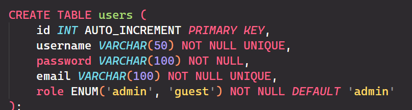
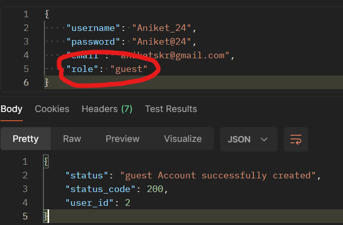
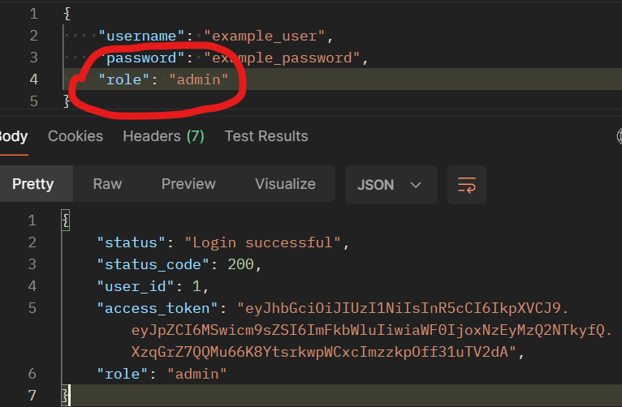

# SDE API Round - Cricbuzz Platform



NOTE: I have used "role" attribute for Role Based Access provision!!

(It's important to pass role ["admin" or "guest"] in the signup and login)





## Prerequisites

- Node.js (v14 or later)
- MySQL (v8 or later)

## Setup

1. Clone the repository:

   `git clone https://github.com/aniket-24/WorkIndia-Cricbuzz.git`

2. Install dependencies:

   `cd WorkIndia-Cricbuzz`

   `npm install`

3. Create a `.env` file in the root directory and add the following environment variables:

```
   PORT=3000
   DB_HOST=localhost
   DB_USER=your_mysql_username
   DB_PASSWORD=your_mysql_password
   DB_NAME=cricbuzz
   JWT_SECRET=your_jwt_secret
```

4. Create the MySQL database:

```
    mysql -u root -p

    CREATE DATABASE cricbuzz;
    USE cricbuzz;
```

5. Run the server:

   `npm start`
